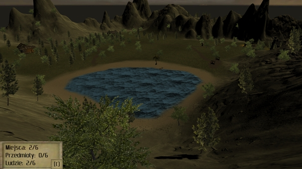
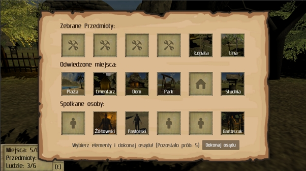
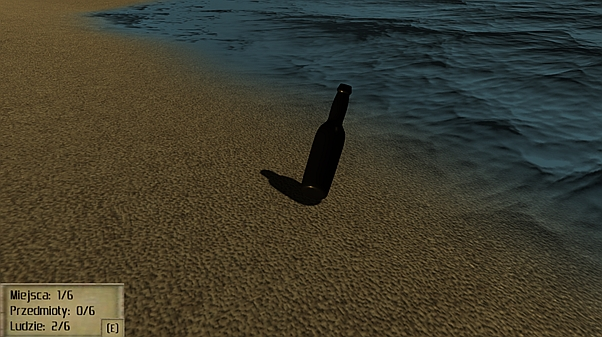
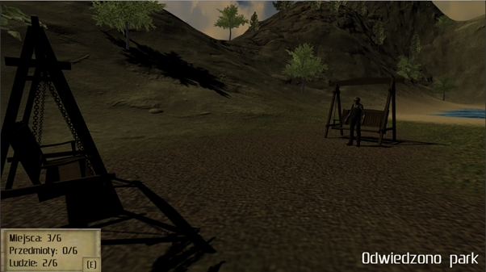
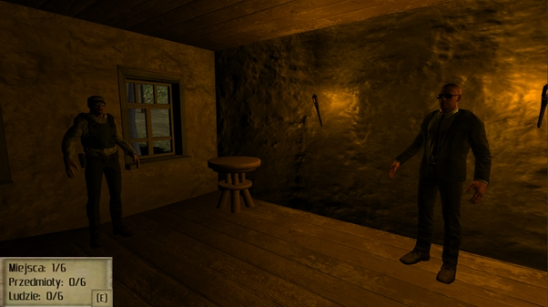
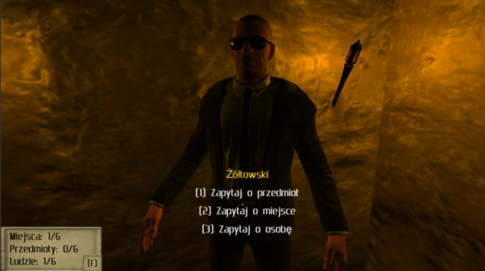
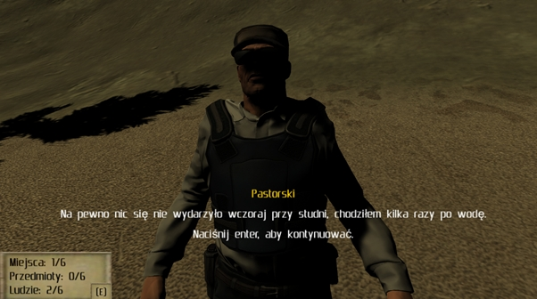
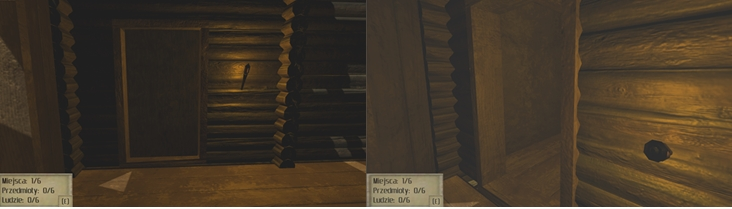
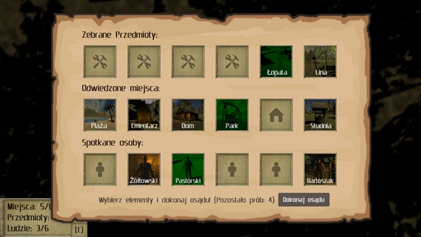

# Cluedo
**1. Wstęp**

Celem tego projektu było stworzenie świata gry do rozegrania komputerowej wersji gry planszowej Cluedo. Naszym zadaniem jest:

-	Zebrać na mapie wszystkie przedmioty
-	Odwiedzić wszystkie miejsca
-	Porozmawiać ze wszystkimi osobami
-	Wskazać mordercę, narzędzie i miejsce zbrodni

**2. Obszar rozgrywki**

Na początku stworzyliśmy duży obszar rozgrywki, po którym gracze będą się poruszać. Staraliśmy się otrzymać jak najbardziej różnorodny teren z jasno wymierzonymi granicami, którymi w naszym przypadku są okalające teren z każdej strony góry. Dodatkowo dla ozdobienia terenu dodano liczne drzewa, jezioro z plażą oraz różne rodzaje terenu. 

W celu zapewnienia miejsc do odwiedzenia przez gracza utworzyliśmy 6 znacząco wyróżniających się miejsc takich jak dom, szopa, cmentarz, studnia, park oraz plaża. 

Rysunek 1. Obszar gry

**3. Gracz**

Jako jeden z pierwszych został również zaimplementowany gracz wraz z całą fizyką, która jest potrzebna w grze do jak najbardziej realistycznego poruszania się. Cała gra odbywa się z widoku pierwszej osoby.
Dodatkowo został utworzony interfejs użytkownika w 2D, dzięki czemu zawsze będziemy wiedzieć ile elementów udało się zebrać, a po otwarciu ekwipunku dowiemy się również jakich. W tym właśnie ekwipunku, będzie również istniała możliwość wybrania kto, czym i gdzie dokonał zbrodni. 

 
Rysunek 2. Ekwipunek

**4. Przedmioty**

Jednym z celów gracza będzie znalezienie na planszy wszystkich porozrzucanych przedmiotów. Przedmioty jakie stworzyliśmy to butelka, siekiera, młotek, nóż, lina oraz łopata. Jeden z nich będzie narzędziem zbrodni, którym popełniono morderstwo.

Każdy z przedmiotów jest automatycznie podnoszony po tym jak gracz w niego wejdzie i w tym momencie znika z planszy i pojawia się w naszym ekwipunku. 
 

Rysunek 3. Przykładowy przedmiot (butelka) znajdujący się na plaży

**5. Odwiedzanie miejsc**

Kolejnym celem gracza będzie odwiedzenie wszystkich wyróżniających się miejsc (2 punkt). Jedno z tych miejsc będzie miejscem zbrodni. Gracz zawsze otrzymuje informację o tym, że dane miejsce zostało odwiedzone. Dodatkowo może sprawdzić to również w lewym dolnym rogu lub ekwipunku. Na tej samej zasadzie jak w przypadku przedmiotów.

Rysunek 4. Przykład odwiedzenia miejsca

**6. Rozmowy**

Ostatnim i najważniejszym elementem rozgrywki są rozmowy z postaciami znajdującymi się w grze. To dzięki nim ustalimy kto, gdzie i w jaki sposób dokonał zbrodni. Na całej mapie zamieściliśmy 6 osób (lista nazwisk jest przypadkowa): Pawelczak, Żółtowski, Pastorski, Karman, Zieliński i Bartoszak. Do dokonania osądu trzeba będzie porozmawiać z każdą postacią.
 

Rysunek 5. Przykładowe postacie

Kiedy tylko się zbliżymy do osoby, otworzy nam się komunikat, informujący, że możemy nacisnąć klawisz F, by z tą osobą porozmawiać. Po rozpoczęciu rozmowy, mamy do wyboru 3 opcje dialogowe.
 

Rysunek 6. Opcje do wyboru podczas rozmowy

Należy uważnie wysłuchać co każda z osób ma nam do powiedzenia na dany temat, tylko w ten sposób jesteśmy w stanie rozwiązać zagadkę! Każda wypowiedź jest na wagę złota i daje nam sugestię co do możliwego rozwiązania.
 

Rysunek 7. Przykładowa wypowiedź postaci

**7. Animacje**

W grze występuje również sporo elementów interaktywnych takich jak otwieranie drzwi czy ruchome przedmioty. Na przykładzie (Rys.8) widzimy otwieranie drzwi po opuszczeniu w dół pochodni.
  

Rysunek 8. Drzwi przesuwne otwierane po opuszczeniu pochodni

Co więcej do rozgrywki dodaliśmy animacje tekstu, informującą nas o zebranych przedmiotach czy odwiedzonych miejscach.

**8. Muzyka**

Do rozgrywki dodaliśmy również muzykę, odpowiadającą klimatem do scenerii. Trzymająca w napięciu melodia, nadaje tajemniczości i realizmu przeprowadzanemu dochodzeniu. 

**9. Zakończenie gry**

Celem gry jest poprawne wskazanie kto, czym i gdzie zabił dokładnie tak jak to jest w przypadku planszowej wersji gry Cluedo. Jak już wspomniano wcześniej, do dokonania osądu wykorzystamy nasz ekwipunek, na którym możemy wybrać z listy zebranych przedmiotów, odwiedzonych miejsc oraz poznanych postaci. Mamy określoną liczbę prób. Jeśli zaznaczymy poprawnie to wygrywamy grę! 

 

Rysunek 9. Przykładowe zaznaczenie rozwiązania

 
Rysunek 10. A jeśli przekroczymy ilość prób…

**10. Podsumowanie**

Projekt udało się zrealizować, a podczas jego tworzenia nauczyliśmy się stosować bardzo wiele nowych elementów i rozwiązań. Sam proces tworzenia był bardzo przyjemny i nie możemy się doczekać stworzenia kolejnej gry!
